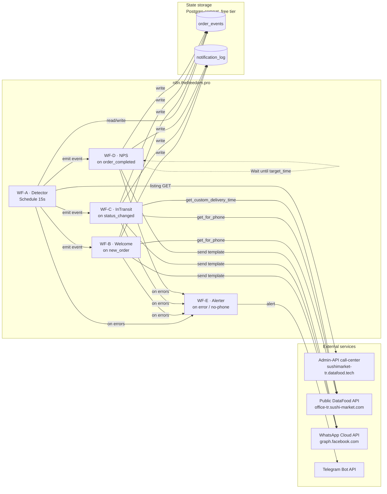
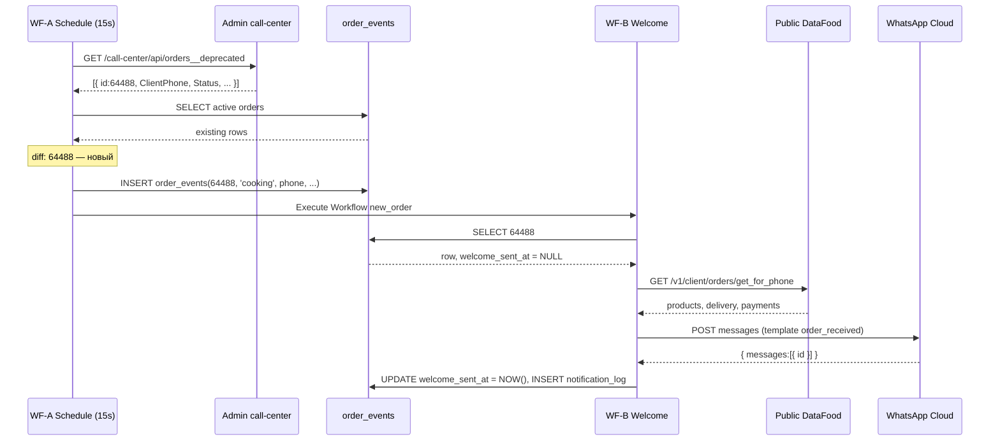
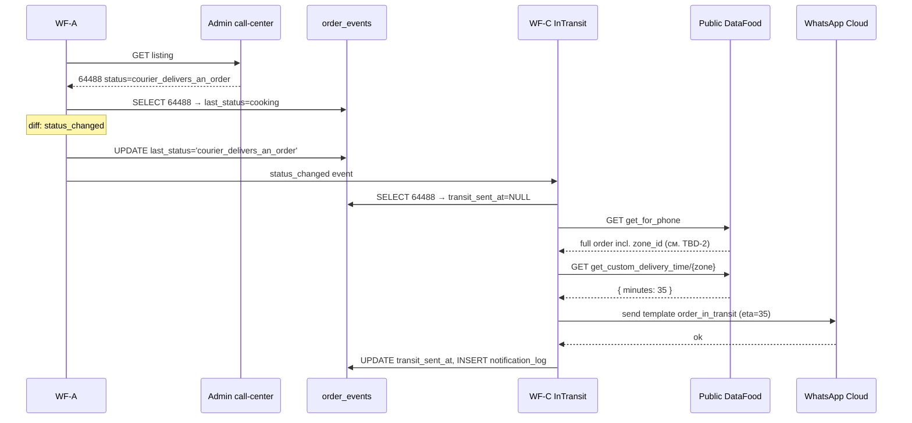
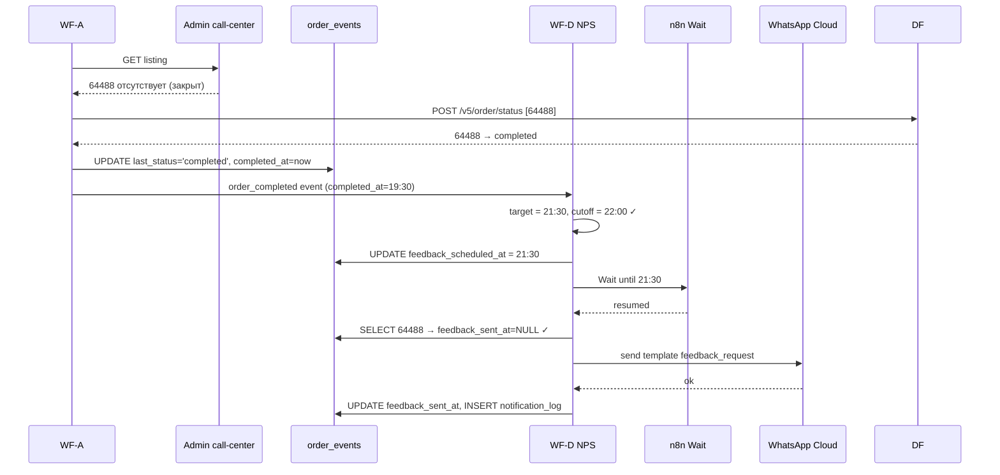
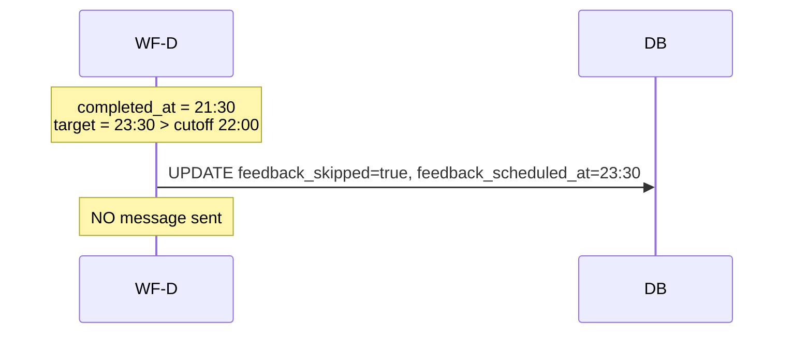

# SushiMarket TR — System Design

> Output `/sc:design`. Архитектурный блюпринт для реализации требований из [PLAN.md](PLAN.md).
> Этот документ описывает **что и как устроено**, но не содержит реального кода. Имплементация — отдельный шаг (`/sc:implement`).

---

## 1. Overview

Система — серия воркфлоу в существующем n8n (`https://n8n.thefreedom.pro`), которые опрашивают admin-API call-center, детектируют события заказа, дёргают публичный DataFood API за деталями и шлют сообщения через WhatsApp Cloud API. Состояние хранится во внешней Postgres-совместимой БД для идемпотентности и отложенного NPS.

### 1.1 C4 — Component diagram



### 1.2 Стек

| Слой              | Технология                                                                 |
|-------------------|----------------------------------------------------------------------------|
| Workflow runtime  | n8n Community Edition (self-hosted, существующий)                          |
| Orchestration     | n8n Schedule + Execute Workflow + Wait                                     |
| Persistence       | Внешняя Postgres-совместимая БД (см. §3 — варианты бесплатных провайдеров) |
| Outbound messaging | WhatsApp Cloud API (utility templates), Telegram Bot API (алерты)         |
| Source of truth (orders) | Public DataFood API + admin-API call-center (триггер)               |
| Secrets           | n8n credentials + env-переменные на инстансе                               |
| Source code       | Git (Seton1xGit), workflow.json + DDL + README + .env.example              |

---

## 2. Workflow structure

Разделяем на 5 независимых workflow. Связаны между собой через **Execute Workflow** ноду n8n с типизированной полезной нагрузкой (см. §4).

### 2.1 WF-A — Detector

| Поле | Значение |
|------|----------|
| Trigger | Schedule, every 15 seconds |
| Назначение | Источник всех событий жизненного цикла заказа |
| Side effects | UPSERT в `order_events`; вызов WF-B / WF-C / WF-D через Execute Workflow |
| Failure mode | при HTTP error листинга — retry 3× с экспонентой, потом WF-E (алерт) |

Высокоуровневая структура нод:

```
[Schedule 15s]
  → [HTTP Request: GET listing]                        # call-center
  → [Code: parse + validate response]
  → [Postgres: SELECT active order_events]
  → [Code: compute diff (3 событий)]
  → [SplitInBatches/items]
        ├─ when event=new_order        → [Postgres INSERT] → [Execute Workflow WF-B]
        ├─ when event=status_changed   → [Postgres UPDATE] → [Switch by to_status]
        │       ├─ → courier_delivers_an_order → [Execute Workflow WF-C]
        │       ├─ → completed                 → [Execute Workflow WF-D]
        │       └─ default                     → end
        └─ when event=order_closed     → [HTTP Request /v5/order/status] # подтвердить final status
                                       → [Postgres UPDATE]
                                       → if completed → [Execute Workflow WF-D]
                                       → if canceled  → end (cancel pending NPS — см. §6)
```

### 2.2 WF-B — Welcome (AC-1, AC-6)

| Поле | Значение |
|------|----------|
| Trigger | Execute Workflow trigger (вызывается WF-A с payload `new_order`) |
| Pre-condition | `order_type = delivery` (иначе early-return) |
| Side effects | UPDATE `order_events.welcome_sent_at`; INSERT в `notification_log` |
| Idempotency | если `welcome_sent_at IS NOT NULL` → exit без отправки |

```
[Trigger: ExecuteWorkflow]
  → [Postgres SELECT order_events WHERE order_id]
  → [IF welcome_sent_at IS NULL AND phone valid AND order_type=delivery]
        → [HTTP Request: GET /v1/client/orders/get_for_phone]   # public API
        → [Code: format products list, total]
        → [HTTP Request: WA Cloud API send template order_received]
        → [Postgres UPDATE welcome_sent_at = now()]
        → [Postgres INSERT notification_log]
  → [ELSE if phone invalid]
        → [Postgres UPDATE escalated_no_phone_at = now()]
        → [Execute Workflow WF-E with reason="no_phone"]
```

### 2.3 WF-C — InTransit (AC-2, AC-7)

| Поле | Значение |
|------|----------|
| Trigger | Execute Workflow trigger (WF-A с payload `status_changed → courier_delivers_an_order`) |
| Pre-condition | `order_type = delivery` AND зона настроена |

```
[Trigger]
  → [Postgres SELECT]
  → [IF transit_sent_at IS NULL AND order_type=delivery]
        → [HTTP Request: get_for_phone]
        → [Code: extract zone_id]                                # см. TBD-2
        → [HTTP Request: GET get_custom_delivery_time/{zone}]
        → [IF response.minutes is set]
              → [WA send template order_in_transit with eta=minutes]
              → [Postgres UPDATE transit_sent_at]
              → [Postgres INSERT notification_log]
        → [ELSE]
              → [Postgres UPDATE transit_skipped=true]
              → [Execute Workflow WF-E with reason="zone_not_configured"]
```

### 2.4 WF-D — NPS (AC-3)

| Поле | Значение |
|------|----------|
| Trigger | Execute Workflow trigger (WF-A с payload `order_completed`) |
| Specifics | Wait-node до конкретного timestamp; n8n persists wait через рестарты |

```
[Trigger]
  → [Code: target = completed_at + 2h]
  → [Code: cutoff = today_22:00 in Europe/Istanbul]
  → [IF target > cutoff]
        → [Postgres UPDATE feedback_skipped=true,
                            feedback_scheduled_at = target]
        → end
  → [ELSE]
        → [Postgres UPDATE feedback_scheduled_at = target]
        → [Wait until target]
        → [Postgres SELECT order_events]                  # перепроверить состояние
        → [IF feedback_sent_at IS NULL AND last_status='completed']
              → [WA send template feedback_request]
              → [Postgres UPDATE feedback_sent_at = now()]
              → [Postgres INSERT notification_log]
```

### 2.5 WF-E — Alerter

| Поле | Значение |
|------|----------|
| Trigger | Execute Workflow trigger (вызывается из любого WF при ошибке/особом кейсе) |

```
[Trigger payload: { reason, order_id?, error?, context }]
  → [Code: format Telegram message]
  → [HTTP Request: Telegram sendMessage]
```

Дроссель: если одно и то же `reason` для одного `order_id` уже отправлено за последние 30 мин — не дублировать (хранится в `notification_log`).

---

## 3. Data model

### 3.1 Выбор хранилища

n8n не предоставляет durable persistent state, гарантированно доступный из всех workflow. Нужна внешняя БД.

Варианты бесплатных Postgres:
1. **Supabase Free** — 500 MB, 2 проекта, REST + native PG. Рекомендован.
2. **Neon Free** — serverless Postgres, 0.5 GB. Альтернатива.
3. **ElephantSQL Tiny Turtle** — 20 MB. Маловато на горизонте.
4. SQLite внутри файла на n8n-хосте — работает, если есть доступ к persistent volume на `n8n.thefreedom.pro`. Уточнить у владельца хостинга.

**Решение:** по умолчанию Supabase Free. Если у владельца n8n есть готовый Postgres — используем его.

### 3.2 Schema (DDL)

```sql
-- Главная таблица: одна строка на заказ, агрегирует все этапы.
CREATE TABLE order_events (
    order_id              BIGINT       PRIMARY KEY,
    client_phone          TEXT,
    order_type            SMALLINT,                                    -- 1=delivery (TBD-1)
    last_status           TEXT         NOT NULL,
    last_seen_at          TIMESTAMPTZ  NOT NULL DEFAULT NOW(),
    completed_at          TIMESTAMPTZ,                                 -- когда впервые увидели completed
    welcome_sent_at       TIMESTAMPTZ,
    transit_sent_at       TIMESTAMPTZ,
    transit_skipped       BOOLEAN      NOT NULL DEFAULT FALSE,
    feedback_scheduled_at TIMESTAMPTZ,
    feedback_sent_at      TIMESTAMPTZ,
    feedback_skipped      BOOLEAN      NOT NULL DEFAULT FALSE,
    escalated_no_phone_at TIMESTAMPTZ,
    raw_listing_snapshot  JSONB,                                       -- последняя строка из листинга, для аудита
    created_at            TIMESTAMPTZ  NOT NULL DEFAULT NOW(),
    updated_at            TIMESTAMPTZ  NOT NULL DEFAULT NOW()
);

CREATE INDEX idx_order_events_last_status ON order_events(last_status);
CREATE INDEX idx_order_events_seen        ON order_events(last_seen_at);

-- Подробный лог всех исходящих сообщений для отладки/отчётности.
CREATE TABLE notification_log (
    id            BIGSERIAL    PRIMARY KEY,
    order_id      BIGINT       NOT NULL,
    template      TEXT         NOT NULL,                               -- order_received | order_in_transit | feedback_request
    channel       TEXT         NOT NULL DEFAULT 'whatsapp',            -- whatsapp | telegram
    target_phone  TEXT,
    payload       JSONB,                                               -- что отправили
    response      JSONB,                                               -- что вернул провайдер
    success       BOOLEAN      NOT NULL,
    error_text    TEXT,
    sent_at       TIMESTAMPTZ  NOT NULL DEFAULT NOW()
);

CREATE INDEX idx_notification_log_order ON notification_log(order_id, template);

-- Опциональный анти-дубль для алертера WF-E.
CREATE TABLE alert_throttle (
    reason        TEXT         NOT NULL,
    order_id      BIGINT,
    last_sent_at  TIMESTAMPTZ  NOT NULL,
    PRIMARY KEY (reason, order_id)
);
```

### 3.3 Inferred state (производное)

Активный заказ = `last_status` ∉ (`completed`, `canceled`). WF-A берёт активные именно через эту проекцию.

---

## 4. Inter-workflow event contracts

n8n Execute Workflow передаёт JSON. Ниже — фиксированные shapes. Любое расхождение — ошибка валидации в принимающем WF.

### 4.1 `new_order` (WF-A → WF-B)

```json
{
  "event": "new_order",
  "order_id": 64488,
  "client_phone": "905349130325",
  "order_type": 1,
  "status": "cooking",
  "detected_at": "2026-04-27T16:58:42+03:00"
}
```

### 4.2 `status_changed` (WF-A → WF-C / WF-D)

```json
{
  "event": "status_changed",
  "order_id": 64488,
  "client_phone": "905349130325",
  "order_type": 1,
  "from_status": "cooking",
  "to_status": "courier_delivers_an_order",
  "detected_at": "2026-04-27T17:14:08+03:00"
}
```

### 4.3 `order_completed` (WF-A → WF-D)

```json
{
  "event": "order_completed",
  "order_id": 64488,
  "client_phone": "905349130325",
  "order_type": 1,
  "completed_at": "2026-04-27T19:30:00+03:00"
}
```

### 4.4 `alert` (any WF → WF-E)

```json
{
  "reason": "no_phone | zone_not_configured | api_error | token_expired | template_rejected",
  "order_id": 64488,
  "error": "...",
  "context": { /* свободное поле */ }
}
```

---

## 5. Sequence diagrams

### 5.1 Сценарий «новый заказ → приветствие»



### 5.2 Сценарий «cooking → courier_delivers_an_order»



### 5.3 Сценарий «completed → NPS через 2 часа (с ограничением 22:00)»



И отдельно — late-кейс:



---

## 6. Алгоритм диффа в WF-A (детально)

```
INPUT:
  listing[] = result of GET /call-center/api/orders__deprecated
  active[]  = SELECT * FROM order_events
              WHERE last_status NOT IN ('completed','canceled')
              AND last_seen_at > NOW() - interval '7 days'
              -- сторона безопасности: не догоняем заказы недельной давности

OUTPUT events:
  - new_order
  - status_changed
  - order_closed (нужно подтвердить final status)

ALGORITHM:
  listing_ids = set of listing[i].id
  active_ids  = set of active[i].order_id

  # 1. NEW
  for id in (listing_ids - active_ids):
      row = listing[id]
      if not is_valid_phone(row.ClientPhone):
          INSERT into order_events with escalated_no_phone_at=NOW()
          emit alert reason="no_phone"
          continue
      INSERT order_events(id, status=row.Status, phone=..., type=...,
                          last_seen_at=NOW(),
                          raw_listing_snapshot=row)
      emit new_order

  # 2. STATUS CHANGED (still in listing)
  for id in (listing_ids ∩ active_ids):
      row   = listing[id]
      local = active[id]
      if row.Status != local.last_status:
          UPDATE order_events
            SET last_status=row.Status,
                last_seen_at=NOW(),
                raw_listing_snapshot=row,
                updated_at=NOW()
            WHERE order_id=id
          emit status_changed(from=local.last_status, to=row.Status)

  # 3. CLOSED (was active, no longer in listing)
  closed_ids = active_ids - listing_ids
  if closed_ids:
      resp = POST /v5/order/status { orders: closed_ids }
      for r in resp.result:
          UPDATE order_events
            SET last_status=r.status,
                last_seen_at=NOW(),
                completed_at = CASE WHEN r.status='completed' THEN NOW() END,
                updated_at=NOW()
            WHERE order_id=r.id
          if r.status == 'completed':
              emit order_completed
          elif r.status == 'canceled':
              # отменяем будущий NPS — см. §7.3
```

### 6.1 Edge cases

| Кейс | Поведение |
|------|-----------|
| listing пустой | пропускаем «new», обрабатываем «closed» по active |
| HTTP 401 / 403 на листинге | retry 3×, потом alert reason="token_expired" |
| HTTP 5xx | retry 3×, потом alert reason="api_error", не обновляем БД |
| Один и тот же `id` дважды в listing (баг vendor) | берём первый (или последний — детерминированно), UPSERT идемпотентен |
| Заказ исчез из listing, `/v5/order/status` отвечает «не найден» | помечаем `last_status='canceled'`, без emit события |
| Заказ старше 7 дней оживает | игнорируем (защита от ghost) |
| Пропустили несколько polling-тиков (n8n был down) | догоняем через очередной diff. Промежуточные статусы могут быть потеряны — это допустимо |

---

## 7. Идемпотентность и cancel-flow

### 7.1 Источник правды для «было ли отправлено»

Колонки `welcome_sent_at`, `transit_sent_at`, `feedback_sent_at` в `order_events`. Любой WF перед отправкой делает SELECT и проверяет `IS NULL`. Гарантия — **at-most-once на уровне БД** (constraint можно усилить через UPDATE ... WHERE … IS NULL и проверку affected rows).

### 7.2 Race conditions

WF-B и WF-A могут выполниться параллельно для одного `order_id` (теоретически). Митигация:
- В WF-B — UPDATE с RETURNING:
  ```sql
  UPDATE order_events
    SET welcome_sent_at = NOW()
    WHERE order_id = $1 AND welcome_sent_at IS NULL
    RETURNING order_id;
  ```
  Если 0 строк — кто-то уже отправил, выходим без отправки в WA.
- WF-A держит свой курсор; double-emit `new_order` на одну строку фильтруется выше.

### 7.3 Cancel pending NPS

WF-D держит execution в Wait до 2 часов. Если в это время заказ отменяют:
- WF-A видит переход в `canceled` (через `/v5/order/status` после исчезновения из listing).
- WF-A не имеет прямой ссылки на спящую WF-D execution.
- **Решение:** WF-D после resume всегда делает SELECT и проверяет `last_status='completed' AND feedback_sent_at IS NULL`. Если статус не `completed` (т.е. был отменён или что-то сломалось) — exit без отправки. Это «late-cancel» через проверку при пробуждении.

---

## 8. Error handling matrix

| Источник ошибки | Симптом | Действие на месте | Алерт |
|-----------------|---------|--------------------|-------|
| call-center listing — 401 | токен админа невалиден | retry 3× → exit cycle | WF-E reason=`token_expired_callcenter`, **критично** |
| call-center listing — 5xx | временный сбой vendor | retry 3× с экспонентой | WF-E `api_error_callcenter` после 5 подряд циклов |
| public API — 401 | публичный токен невалиден | retry 1×, exit handler | WF-E `token_expired_public`, **критично** |
| public API — 404 | заказ удалён из системы | пометить `last_status='canceled'` | без алерта |
| `get_custom_delivery_time` — 404/empty | зона не настроена | UPDATE `transit_skipped=true`, не шлём WA | WF-E `zone_not_configured` |
| WA Cloud — 4xx (template not approved) | ждём апрува | exit без retry | WF-E `template_rejected` |
| WA Cloud — 4xx (recipient invalid) | плохой телефон | UPDATE `escalated_no_phone_at` | WF-E `no_phone` |
| WA Cloud — 5xx | временный сбой Meta | retry 3× | WF-E `api_error_meta` после 3 неудач |
| Postgres недоступен | catastrophic | n8n сам ретраит worker; exit | WF-E `db_unavailable` (если получится) |
| Сам WF-E недоступен | алерт некуда послать | log в stdout n8n | админ замечает в UI n8n |

---

## 9. Observability

| Метрика | Источник | Назначение |
|---------|----------|------------|
| Запросов листинга в час, средний/последний HTTP-код | n8n execution log | здоровье триггера |
| Новых заказов за день | `notification_log` count `template='order_received'` | бизнес-метрика |
| Доля скиппов NPS (после 22:00) | `order_events feedback_skipped=true / total completed` | оценка покрытия |
| Доля скиппов «в пути» (зона не настроена) | `order_events transit_skipped=true / total delivery completed` | сигнал «настроить зоны» |
| Очередь Wait в WF-D | n8n executions list | прозрачность отложенного NPS |
| 401-алерты | Telegram канал | критичные инциденты |

Daily digest (`WF-F` — опциональный, в scope MVP не входит): cron 09:00 → SELECT агрегаты за вчера → пост в Telegram.

---

## 10. Secrets & env

### 10.1 n8n credentials (зашифрованы в n8n DB)

| Имя credential | Тип в n8n | Используется в |
|----------------|-----------|-----------------|
| `cred_callcenter_admin` | Header Auth | WF-A (Admin-API call-center) |
| `cred_datafood_public` | Header Auth | WF-B, WF-C (public DataFood) |
| `cred_postgres` | Postgres | все WF |
| `cred_meta_whatsapp` | WhatsApp Business Cloud | WF-B, WF-C, WF-D |
| `cred_telegram_bot` | Telegram | WF-E |

### 10.2 Workflow-level static data (n8n env / Static Data)

| Переменная | Пример | Назначение |
|------------|--------|------------|
| `TZ` | `Europe/Istanbul` | расчёт cutoff 22:00 |
| `NPS_DELAY_HOURS` | `2` | сдвиг NPS |
| `NPS_CUTOFF_HOUR` | `22` | граница окна |
| `POLL_INTERVAL_S` | `15` | в Schedule-ноде |
| `META_PHONE_NUMBER_ID` | `…` | source phone в WA Cloud |
| `META_TEMPLATE_RECEIVED` | `order_received_ru` | имя шаблона |
| `META_TEMPLATE_TRANSIT` | `order_in_transit_ru` | имя шаблона |
| `META_TEMPLATE_FEEDBACK` | `feedback_request_ru` | имя шаблона |
| `ADMIN_TG_CHAT_ID` | `-1001234…` | куда слать алерты |
| `ALERT_THROTTLE_MIN` | `30` | анти-флуд алертов |

### 10.3 .env.example в репо

Все ключи выше — без значений. Реальные значения хранятся **только** в n8n credentials и не коммитятся.

---

## 11. Repo structure (Seton1xGit)

```
.
├── README.md                       # как развернуть с нуля
├── PLAN.md                         # требования (этот документ)
├── DESIGN.md                       # дизайн (этот документ)
├── .env.example                    # переменные без значений
├── .gitignore                      # исключает .env, dump-файлы
├── db/
│   ├── 001_init.sql                # DDL из §3.2
│   └── README.md                   # порядок применения
├── n8n/
│   ├── workflows/
│   │   ├── wf-a-detector.json
│   │   ├── wf-b-welcome.json
│   │   ├── wf-c-in-transit.json
│   │   ├── wf-d-nps.json
│   │   └── wf-e-alerter.json
│   └── credentials.template.md     # список credential-ов и где их взять
├── whatsapp-templates/
│   ├── order_received_ru.md
│   ├── order_in_transit_ru.md
│   └── feedback_request_ru.md
└── docs/
    ├── runbook.md                  # что делать при алертах
    ├── handover.md                 # инструкция для заказчика
    └── changelog.md
```

`workflows/*.json` — экспорты n8n. При импорте на новом n8n — создать credentials с теми же именами (`cred_*`) и они автоматически подхватятся.

---

## 12. Соответствие AC из PLAN.md

| AC | Где реализовано | Проверка |
|----|------------------|----------|
| AC-1 (приветствие ≤ 5 мин) | WF-A 15 c poll + WF-B немедленно | `welcome_sent_at - created_at ≤ 5 min` для каждого delivery |
| AC-2 (в пути ≤ 5 мин после смены статуса) | WF-A 15 c + WF-C | `transit_sent_at - last_seen_at(courier_delivers_an_order) ≤ 5 min` |
| AC-3 (NPS через 2 ч, не позже 22:00) | WF-D с Wait + cutoff check | `feedback_sent_at = completed_at + 2h` И `≤ 22:00` |
| AC-4 (each msg exactly once) | UPDATE-WHERE-NULL pattern (§7.2) | `notification_log` уникальные `(order_id, template)` |
| AC-5 (no phone → admin alert) | WF-A + WF-E | `escalated_no_phone_at IS NOT NULL` AND запись в Telegram |
| AC-6 (только delivery) | early-return в WF-B/C/D на `order_type ≠ 1` | `notification_log` пуст для заказов с pickup |
| AC-7 (transit только если зона) | WF-C проверка `minutes` | `transit_skipped=true` иначе `transit_sent_at` |

---

## 13. Validation & open dependencies

Перед `/sc:implement`:

1. **TBD-1 → Решить во время implement:** значение `order_type` для delivery vs pickup. Если в листинге для каждой строки видно `order_type`, можно сделать выгрузку 50 свежих строк и определить эмпирически. Может быть `1=delivery, 2=pickup` или `delivery=1, pickup=0` или строки. Реализуем в Code-ноде с явным маппингом + дефолт «считаем pickup, не шлём» как safe-fallback.
2. **TBD-2 → Решить во время implement:** где зона. Сначала пробуем `data.delivery.zone_id`, `data.zone`, `data.shop.zone`. Если нигде — добавляем мини-роутинг через `city_id`/координаты (out of scope MVP).
3. **TBD-3:** срок жизни Sanctum токена — это операционная задача, не блокирует дизайн.
4. **TBD-4:** тексты шаблонов — отдельный артефакт `whatsapp-templates/*.md`, согласовываем при подготовке отправки в Meta.
5. **TBD-5:** версия n8n — узнаём при первом импорте; если нет WA Business Cloud node, перестраиваем WF-B/C/D на generic HTTP Request к `graph.facebook.com/v17.0/{phone-id}/messages`.

---

## 14. Рекомендованный порядок имплементации

1. Создать репо `Seton1xGit`, инициализировать `README.md`, `.gitignore`, `.env.example`, скопировать сюда PLAN.md и DESIGN.md.
2. Поднять Postgres-инстанс (Supabase Free), применить `db/001_init.sql`.
3. Настроить 5 credentials в n8n (см. §10.1).
4. Реализовать WF-E (алертер) — нужен раньше остальных, чтобы видеть ошибки.
5. Реализовать WF-A — детектор. На этом этапе валидируем TBD-1 (значения order_type) на живом листинге.
6. Реализовать WF-B — приветствие. Самый простой happy path.
7. Параллельно: подать 3 шаблона в Meta на ревью (TBD-4).
8. Реализовать WF-C — in-transit, валидируя TBD-2 (поле zone).
9. Реализовать WF-D — NPS. Тестировать на сжатых интервалах (5 мин вместо 2 ч) сначала.
10. End-to-end тест на тестовом заказе, проверка всех 8 пунктов §8 PLAN.md тест-чеклиста.
11. Хендовер заказчику: README + handover.md + экспорт workflow.json + DDL.
